# PlantUML Benutzungsanleitung

Diese Anleitung zeigt, wie Sie mit PlantUML verschiedene UML-Diagramme erstellen.

## Schnellstart

### Grundlegende Syntax

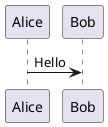

## Sequenzdiagramm

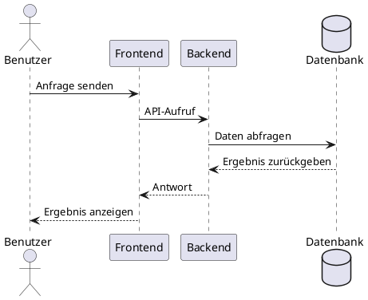

## Klassendiagramm

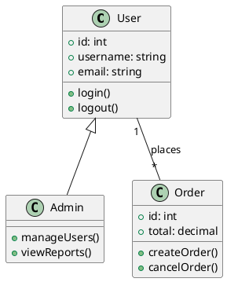

## Anwendungsfalldiagramm

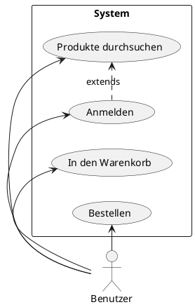

## Zustandsdiagramm

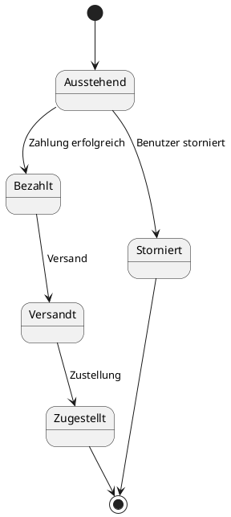

## Aktivitätsdiagramm

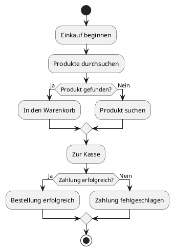

## Komponentendiagramm

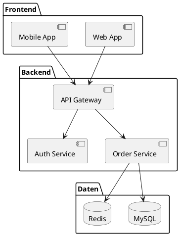

## Verteilungsdiagramm

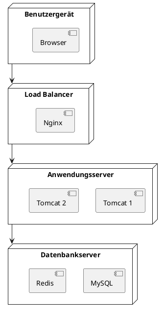

## Zeitdiagramm

```plantuml
@startuml
clock "Uhr" as C with period 1000
binary "Synchronisation" as SY
binary "Daten" as DT

C is idle
SY is low
DT is low

@1000
SY is high
@1500
SY is low
@2000
DT is high
@3000
DT is low
@enduml
```

## Gantt-Diagramm

```plantuml
@startuml
[Design] lasts 5 days
[Entwicklung] lasts 10 days
[Tests] lasts 5 days
[Veröffentlichung] lasts 3 days

[Design] starts at 2024-01-01
[Entwicklung] starts at 2024-01-06
[Tests] starts at 2024-01-16
[Veröffentlichung] starts at 2024-01-21
@enduml
```

## Mindmap

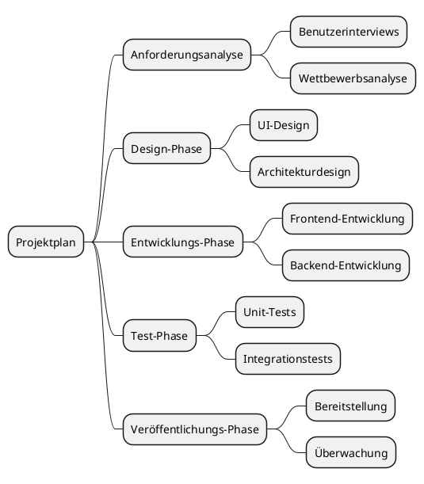

## Häufige Befehle

### Elemente ausblenden

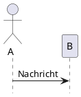

### Stil-Einstellungen

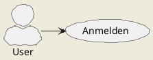

## Verwandte Ressourcen

- [PlantUML Offizielle Website](https://plantuml.com/)
- [PlantUML Syntax-Referenz](https://plantuml.com/sitemap-language-specification)
