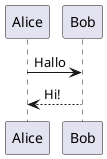
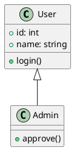

# PlantUML Benutzerhandbuch

## Grundlegende Syntax

### Sequenzdiagramm



### Klassendiagramm



---

## Diagrammtypen

- Sequenzdiagramme
- Klassendiagramme
- Use-Case-Diagramme
- Aktivitätsdiagramme
- Zustandsdiagramme
- Komponentendiagramme

---

## Export

```bash
java -jar plantuml.jar -tpng diagramm.wsd
```
