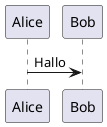

# PlantUML

Open-Source-Tool zum Zeichnen von UML-Diagrammen

## Übersicht

PlantUML ermöglicht das Erstellen verschiedener Diagramme aus einfachem Text.

## Schnellstart

## Dokumentation

- [Installationsanleitung](./2.Installationsanleitung.md)
- [Benutzerhandbuch](./3.Benutzerhandbuch.md)
- [FAQ](./4.FAQ.md)
