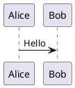

# PlantUML

PlantUML ist ein Open-Source-Tool zum schnellen Erstellen von UML-Diagrammen.

## Einführung

PlantUML ermöglicht es Ihnen, verschiedene UML-Diagramme mit einfachen Textbeschreibungen zu erstellen, einschließlich Sequenzdiagrammen, Klassendiagrammen, Anwendungsfalldiagrammen, Aktivitätsdiagrammen und mehr.

## Hauptmerkmale

- **Vielfältige Diagrammtypen**: Sequenz-, Klassen-, Anwendungsfall-, Zustands-, Aktivitätsdiagramme usw.
- **Einfache Syntax**: Klartextbeschreibung, einfach zu schreiben und zu pflegen
- **Plattformübergreifend**: Unterstützt Windows, macOS, Linux
- **Integration**: Unterstützt VS Code, IntelliJ, Eclipse
- **Echtzeit-Vorschau**: Effekte sofort beim Bearbeiten sehen

## Schnellstart

### Installation

```bash
# macOS
brew install plantuml

# Ubuntu
sudo apt install plantuml
```

### Verwendung



## Dokumentation

- [Installationsanleitung](./1.安装文档.md)
- [Benutzungsanleitung](./2.使用指南.md)

## Verwandte Ressourcen

- [Offizielle Website](https://plantuml.com/)
- [Online-Editor](https://www.plantuml.com/plantuml)

## Lizenz

GPL License
