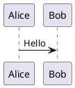

# PlantUML Installation Guide

## Prerequisites

- **Java Runtime**: Java 8 or higher required
- **Memory**: Minimum 512MB RAM
- **Disk Space**: 100MB for installation

---

## Standalone Installation

### Windows

1. Download the PlantUML JAR file from: https://sourceforge.net/projects/plantuml/files/
2. Save the `plantuml.jar` file to a convenient location
3. (Optional) Add the location to your PATH environment variable

### macOS

Using Homebrew:

```bash
brew install plantuml
```

### Linux

Using package manager:

```bash
# Debian/Ubuntu
sudo apt-get install plantuml

# Fedora
sudo dnf install plantuml

# Arch Linux
sudo pacman -S plantuml
```

Or download JAR:

```bash
wget https://sourceforge.net/projects/plantuml/files/plantuml.jar
java -jar plantuml.jar
```

---

## IDE Integration

### VS Code

1. Open VS Code
2. Go to Extensions (Ctrl+Shift+X)
3. Search for "PlantUML"
4. Install "PlantUML" by "Jebbs"
5. Restart VS Code

### IntelliJ IDEA / Android Studio

1. Go to Settings → Plugins
2. Search for "PlantUML"
3. Install "PlantUML integration"
4. Restart IDE

### Eclipse

1. Go to Help → Eclipse Marketplace
2. Search for "PlantUML"
3. Install "PlantUML"
4. Restart Eclipse

---

## Verify Installation

### Command Line

```bash
java -jar plantuml.jar -version
```

### VS Code

Create a new file with `.wsd` extension:



Right-click and select "Preview Current Diagram"

---

## Configuration

### VS Code Settings

```json
{
    "plantuml.server": "https://www.plantuml.com/plantuml",
    "plantuml.render": "PlantUMLServer",
    "plantuml.exportOutDir": "${workspaceFolder}/export"
}
```

### Java Memory Options

For large diagrams, increase Java heap size:

```bash
java -Xmx1024m -jar plantuml.jar diagram.wsd
```
