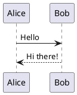
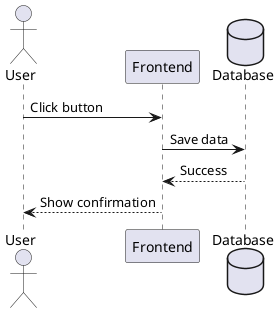
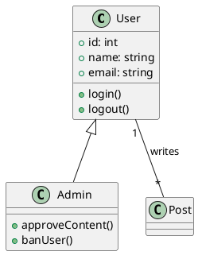
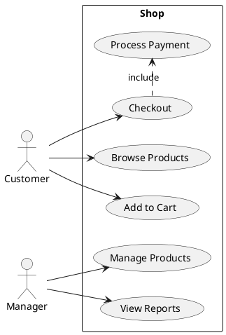
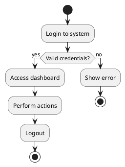
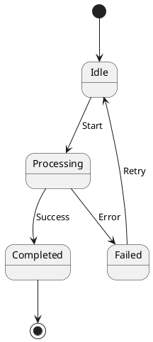
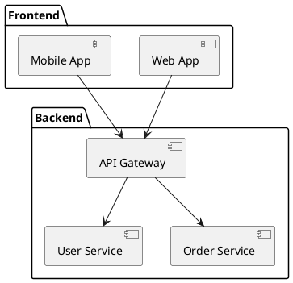
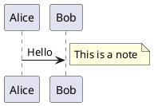
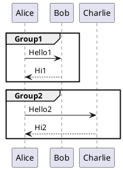

# PlantUML User Manual

## Basic Syntax

### Comments

```plantuml
' This is a comment
```

### Alice-Bob Diagram



---

## UML Diagrams

### Sequence Diagram



### Class Diagram



### Use Case Diagram



### Activity Diagram



### State Diagram



### Component Diagram



---

## Advanced Features

### Skinparam

```plantuml
@startuml
skinparam backgroundColor #DDD
skinparam classBackgroundColor #lightblue
skinparam arrowColor #333

class Demo
@enduml
```



### Notes



### Grouping



---

## Export Diagrams

### Command Line

```bash
# Export to PNG
java -jar plantuml.jar diagram.wsd

# Export to SVG
java -jar plantuml.jar -tsvg diagram.wsd

# Export to PDF
java -jar plantuml.jar -tpdf diagram.wsd
```

### VS Code

Right-click in the editor and select:
- "Export Current Diagram"
- Choose format (PNG/SVG/PDF)
