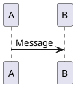

# PlantUML FAQ

## General Questions

### What is PlantUML?

PlantUML is an open-source tool that allows you to create various types of diagrams (UML, network, flowchart, etc.) from plain text descriptions.

### Is PlantUML free?

Yes, PlantUML is open-source and free to use under GPL license.

### What programming languages does PlantUML support?

PlantUML is language-agnostic. You can use it to create diagrams for any programming language or system design.

---

## Installation Questions

### Why do I need Java?

PlantUML is written in Java, so it requires Java Runtime Environment (JRE) 8 or higher.

### How do I install PlantUML?

- **Windows**: Download JAR file
- **macOS**: `brew install plantuml`
- **Linux**: Use package manager or download JAR
- **IDE**: Install plugin from marketplace

### "java" is not recognized as an internal or external command?

Ensure Java is installed and the `JAVA_HOME` environment variable is set correctly. Add Java `bin` directory to your PATH.

---

## Usage Questions

### How do I create a sequence diagram?

Use `@startuml` and `@enduml` tags:



### How do I add color to elements?

Use `#[color]` syntax:

```plantuml
class Test #[red]
```

### How do I export diagrams?

**Command Line**:
```bash
java -jar plantuml.jar -tpng diagram.wsd
```

**VS Code**: Right-click → Export Current Diagram

---

## Troubleshooting

### Diagram not rendering in VS Code?

- Check if PlantUML extension is installed
- Ensure Java is in PATH
- Check VS Code output console for errors

### Out of memory errors?

Increase Java heap size:

```bash
java -Xmx2048m -jar plantuml.jar diagram.wsd
```

### Special characters not displaying correctly?

Add encoding option:

```bash
java -Dfile.encoding=UTF-8 -jar plantuml.jar -charset UTF-8 diagram.wsd
```

---

## Common Error Codes

| Error | Description | Solution |
|-------|-------------|----------|
| C:\... not found | Java not in PATH | Add Java to PATH |
| OutOfMemoryError | Not enough memory | Increase -Xmx value |
| ParseException | Syntax error in diagram | Check syntax |
