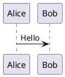

# PlantUML

Open-source tool to draw UML diagrams from text descriptions

## Overview

PlantUML allows you to create various diagrams from plain text. It supports UML, sequence, class, activity, and many other diagram types.

## Quick Start

## Supported Diagrams

- Sequence diagrams
- Class diagrams
- Use Case diagrams
- Activity diagrams
- State diagrams
- Component diagrams
- Network diagrams
- Gantt charts

## Documentation

- [Installation Guide](./2.Installation-Guide.md)
- [User Manual](./3.User-Manual.md)
- [FAQ](./4.FAQ.md)

## License

GPL License
