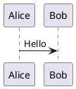
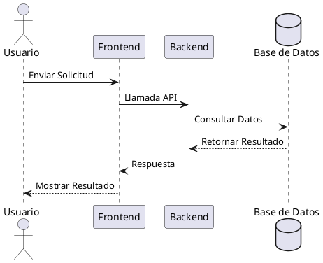
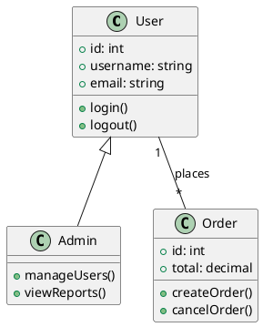
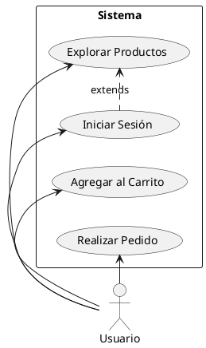
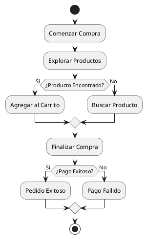
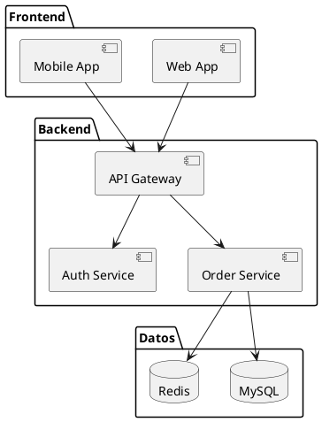
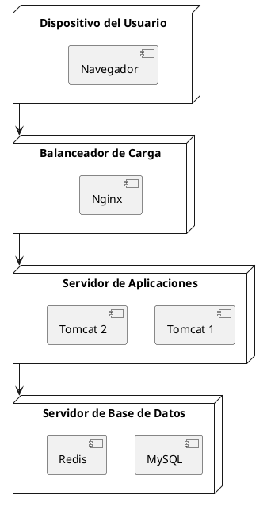
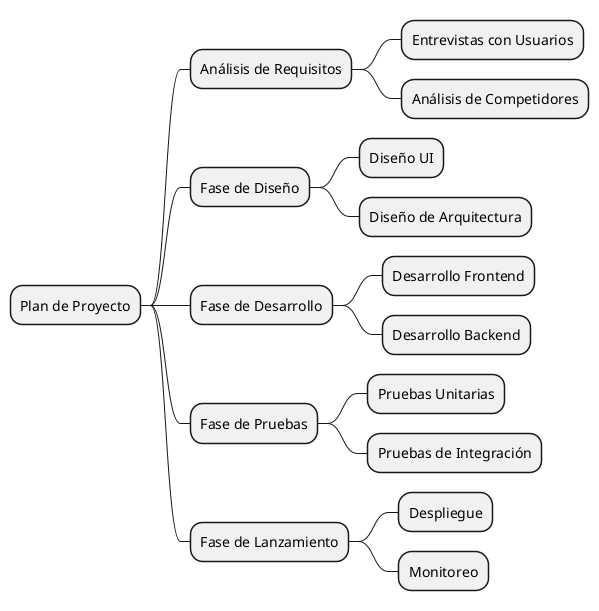
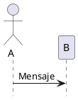
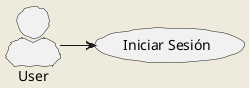

# Guía de Uso de PlantUML

Esta guía introduce cómo usar PlantUML para crear varios diagramas UML.

## Inicio Rápido

### Sintaxis Básica



## Diagrama de Secuencia



## Diagrama de Clases



## Diagrama de Casos de Uso



## Diagrama de Estados

```plantuml
@startuml
[*] --> Pendiente de Pago
Pendiente de Pago --> Pagado: Pago Exitoso
Pagado --> Enviado: Envío
Enviado --> Entregado: Entrega
Entregado --> [*]
Pendiente de Pago --> Cancelado: Usuario Cancela
Cancelado --> [*]
@enduml
```

## Diagrama de Actividades



## Diagrama de Componentes



## Diagrama de Despliegue



## Diagrama de Timing

```plantuml
@startuml
clock "Reloj" as C with period 1000
binary "Sincronización" as SY
binary "Datos" as DT

C is idle
SY is low
DT is low

@1000
SY is high
@1500
SY is low
@2000
DT is high
@3000
DT is low
@enduml
```

## Diagrama de Gantt

```plantuml
@startuml
[Diseño] lasts 5 days
[Desarrollo] lasts 10 days
[Pruebas] lasts 5 days
[Lanzamiento] lasts 3 days

[Diseño] starts at 2024-01-01
[Desarrollo] starts at 2024-01-06
[Pruebas] starts at 2024-01-16
[Lanzamiento] starts at 2024-01-21
@enduml
```

## Mapa Mental



## Comandos Comunes

### Ocultar Elementos



### Configuración de Estilos



## Recursos Relacionados

- [Sitio Web Oficial de PlantUML](https://plantuml.com/)
- [Referencia de Sintaxis PlantUML](https://plantuml.com/sitemap-language-specification)
