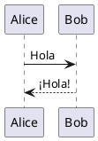
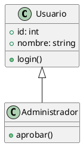

# PlantUML Manual de Usuario

## Sintaxis Básica

### Diagrama de Secuencia



### Diagrama de Clases



---

## Tipos de Diagramas

- Diagramas de secuencia
- Diagramas de clases
- Diagramas de casos de uso
- Diagramas de actividad
- Diagramas de estado

---

## Exportar

```bash
java -jar plantuml.jar -tpng diagrama.wsd
```
