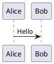

# PlantUML

PlantUML es una herramienta de código abierto para crear diagramas UML rápidamente.

## Introducción

PlantUML le permite crear diversos diagramas UML utilizando descripciones de texto simples, incluyendo diagramas de secuencia, diagramas de clases, diagramas de casos de uso, diagramas de actividades, y más.

## Características Principales

- **Múltiples tipos de diagramas**: Diagramas de secuencia, clases, casos de uso, estados, actividades, etc.
- **Sintaxis simple**: Descripción en texto plano, fácil de escribir y mantener
- **Multiplataforma**: Compatible con Windows, macOS y Linux
- **Integración**: Soporta VS Code, IntelliJ, Eclipse
- **Vista previa en tiempo real**: Ver efectos inmediatamente al editar

## Inicio Rápido

### Instalación

```bash
# macOS
brew install plantuml

# Ubuntu
sudo apt install plantuml
```

### Uso



## Documentación

- [Guía de Instalación](./1.安装文档.md)
- [Guía de Uso](./2.使用指南.md)

## Recursos Relacionados

- [Sitio Web Oficial](https://plantuml.com/)
- [Editor en Línea](https://www.plantuml.com/plantuml)

## Licencia

GPL License
