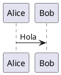

# PlantUML

Herramienta de código abierto para dibujar diagramas UML

## Descripción

PlantUML permite crear varios diagramas a partir de texto simple.

## Inicio Rápido

## Documentación

- [Guía de Instalación](./2.Guía-de-Instalación.md)
- [Manual de Usuario](./3.Manual-de-Usuario.md)
- [Preguntas Frecuentes](./4.Preguntas-Frecuentes.md)
