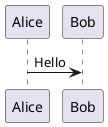
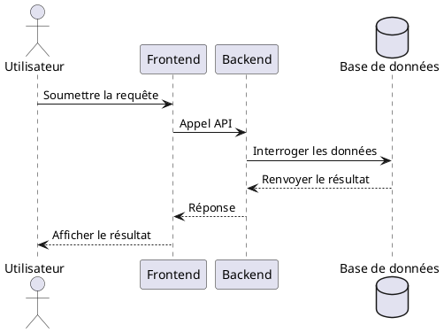
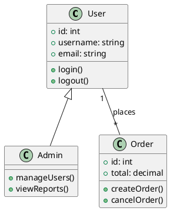
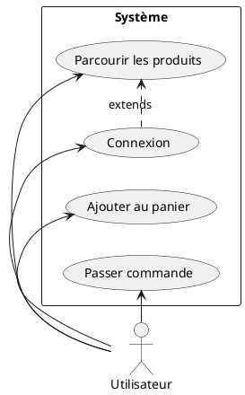
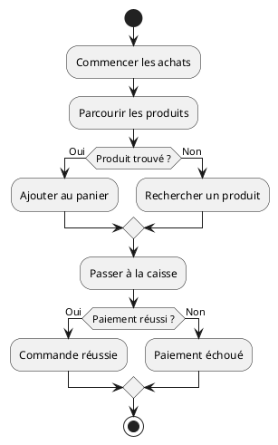
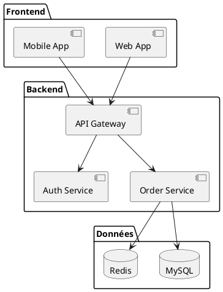
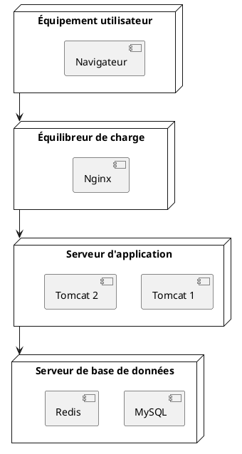
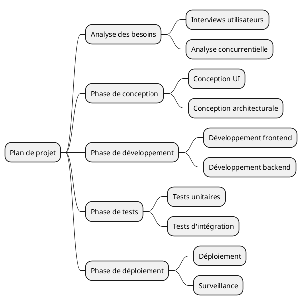
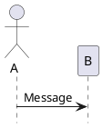
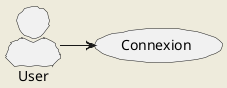

# Guide d'utilisation PlantUML

Ce guide explique comment utiliser PlantUML pour créer divers diagrammes UML.

## Démarrage rapide

### Syntaxe de base



## Diagramme de séquence



## Diagramme de classes



## Diagramme de cas d'utilisation



## Diagramme d'état

```plantuml
@startuml
[*] --> En attente de paiement
En attente de paiement --> Payé: Paiement réussi
Payé --> Expédié: Expédition
Expédié --> Livré: Livraison
Livré --> [*]
En attente de paiement --> Annulé: Utilisateur annule
Annulé --> [*]
@enduml
```

## Diagramme d'activité



## Diagramme de composants



## Diagramme de déploiement



## Diagramme de timing

```plantuml
@startuml
clock "Horloge" as C with period 1000
binary "Synchronisation" as SY
binary "Données" as DT

C is idle
SY is low
DT is low

@1000
SY is high
@150 low
@2000
DT is0
SY is high
@3000
DT is low
@enduml
```

## Diagramme de Gantt

```plantuml
@startuml
[Conception] lasts 5 days
[Développement] lasts 10 days
[Tests] lasts 5 days
[Déploiement] lasts 3 days

[Conception] starts at 2024-01-01
[Développement] starts at 2024-01-06
[Tests] starts at 2024-01-16
[Déploiement] starts at 2024-01-21
@enduml
```

## Carte mentale



## Commandes courantes

### Masquer les éléments



### Configuration des styles



## Ressources associées

- [Site officiel PlantUML](https://plantuml.com/)
- [Référence de syntaxe PlantUML](https://plantuml.com/sitemap-language-specification)
