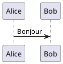
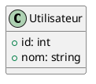

# PlantUML Manuel Utilisateur

## Syntaxe de Base

### Diagramme de Séquence

### Diagramme de Classes

## Types de Diagrammes

- Diagrammes de séquence
- Diagrammes de classes
- Diagrammes d'activité
