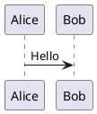

# PlantUML

PlantUML est un outil open source pour créer rapidement des diagrammes UML.

## Introduction

PlantUML vous permet de créer divers diagrammes UML en utilisant de simples descriptions textuelles, notamment des diagrammes de séquence, des diagrammes de classes, des diagrammes de cas d'utilisation, des diagrammes d'activité, et plus encore.

## Caractéristiques principales

- **Plusieurs types de diagrammes** : Diagrammes de séquence, de classes, de cas d'utilisation, d'état, d'activité, etc.
- **Syntaxe simple** : Description en texte brut, facile à écrire et à maintenir
- **Multiplateforme** : Supporte Windows, macOS, Linux
- **Intégration** : Supporte VS Code, IntelliJ, Eclipse
- **Aperçu en temps réel** : Voir les effets immédiatement lors de l'édition

## Démarrage rapide

### Installation

```bash
# macOS
brew install plantuml

# Ubuntu
sudo apt install plantuml
```

### Utilisation



## Documentation

- [Guide d'installation](./1.安装文档.md)
- [Guide d'utilisation](./2.使用指南.md)

## Ressources associées

- [Site officiel](https://plantuml.com/)
- [Éditeur en ligne](https://www.plantuml.com/plantuml)

## Licence

GPL License
