# PlantUML 使用ガイド

このガイドでは、PlantUMLを使用してさまざまなUML図を作成方法について説明します。

## クイックスタート

### 基本的な構文

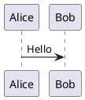

## シーケンス図

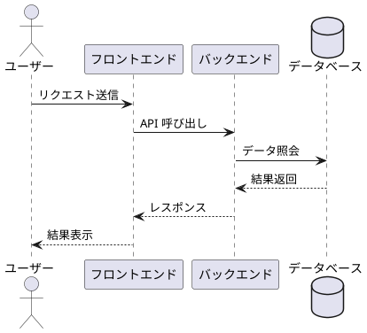

## クラス図

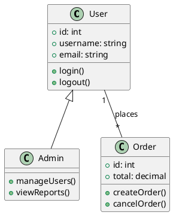

## ユースケース図

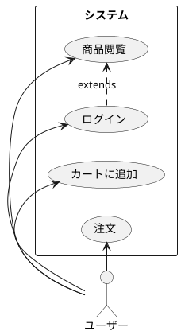

## 状態図

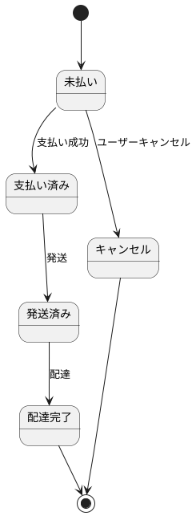

## アクティビティ図

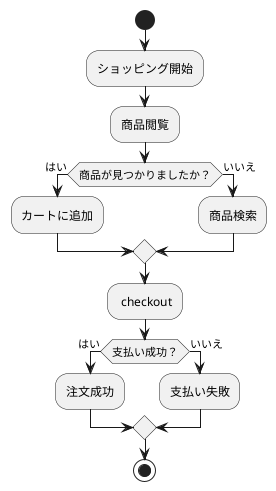

## コンポーネント図

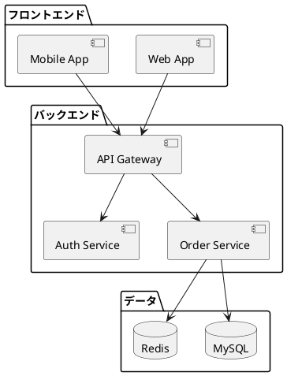

## デプロイメント図

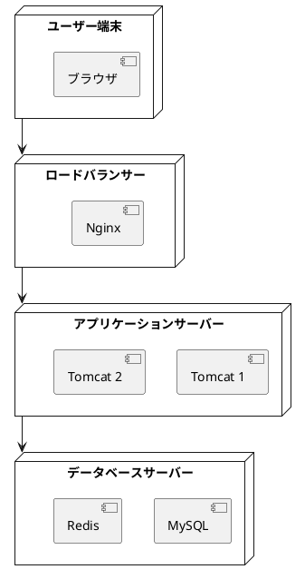

## タイミング図

```plantuml
@startuml
clock "クロック" as C with period 1000
binary "同期" as SY
binary "データ" as DT

C is idle
SY is low
DT is low

@1000
SY is high
@1500
SY is low
@2000
DT is high
@3000
DT is low
@enduml
```

## ガンチャート

```plantuml
@startuml
[設計] lasts 5 days
[開発] lasts 10 days
[テスト] lasts 5 days
[リリース] lasts 3 days

[設計] starts at 2024-01-01
[開発] starts at 2024-01-06
[テスト] starts at 2024-01-16
[リリース] starts at 2024-01-21
@enduml
```

## マインドマップ

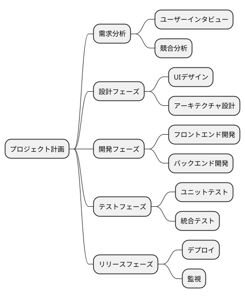

## 一般的なコマンド

### 要素を非表示

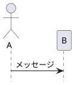

### スタイル設定

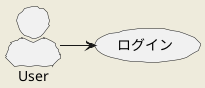

## 関連リソース

- [PlantUML 公式サイト](https://plantuml.com/)
- [PlantUML 構文リファレンス](https://plantuml.com/sitemap-language-specification)
