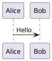

# PlantUML

PlantUMLは、UML図を素早く作成するためのオープンソースツールです。

## 概要

PlantUMLを使用すると、シンプルなテキスト記述でシーケンス図、クラス図、ユースケース図、活动図など、さまざまなUML図を作成できます。

## 主な機能

- **多様な図の種類**：シーケンス図、クラス図、ユースケース図、状態図、活动図など
- **シンプルな構文**：プレーンテキストで記述でき、書きやすくメンテナンスしやすい
- **クロスプラットフォーム**：Windows、macOS、Linuxに対応
- **統合**：VS Code、IntelliJ、Eclipseをサポート
- **リアルタイムプレビュー**：編集するとすぐに効果を確認できます

## クイックスタート

### インストール

```bash
# macOS
brew install plantuml

# Ubuntu
sudo apt install plantuml
```

### 使用方法



## ドキュメント

- [インストールガイド](./1.安装文档.md)
- [使用ガイド](./2.使用指南.md)

## 関連リソース

- [公式サイト](https://plantuml.com/)
- [オンラインエディタ](https://www.plantuml.com/plantuml)

## ライセンス

GPL License
