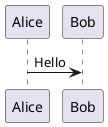
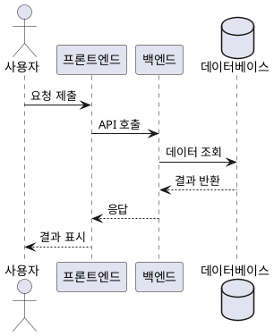
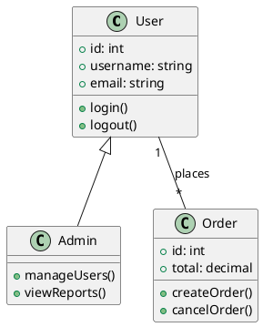
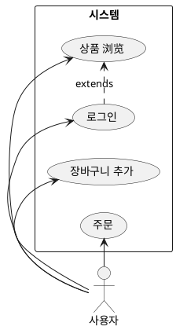
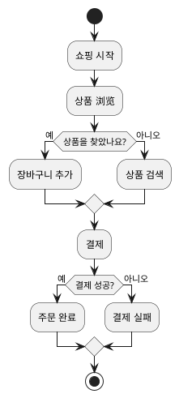
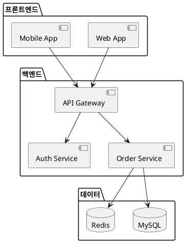
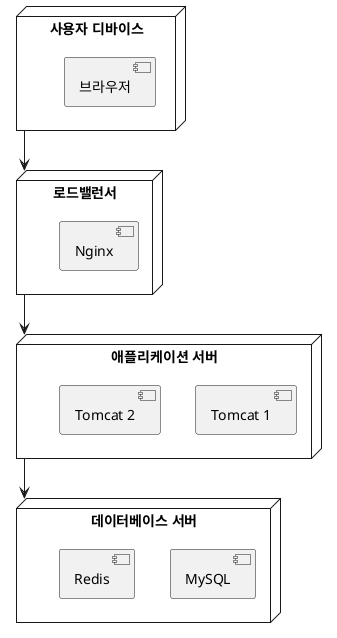
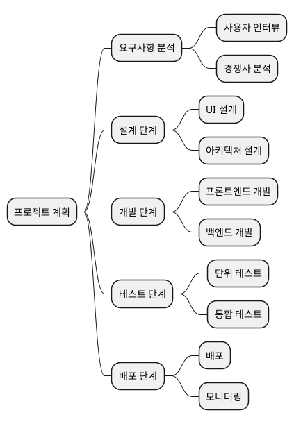
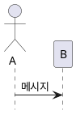
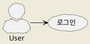

# PlantUML 사용 가이드

이 가이드에서는 PlantUML을 사용하여 다양한 UML 다이어그램을 생성하는 방법을 설명합니다.

## 빠른 시작

### 기본 문법



## 시퀀스 다이어그램



## 클래스 다이어그램



## 유스케이스 다이어그램



## 상태 다이어그램

```plantuml
@startuml
[*] --> 결제 대기
결제 대기 --> 결제 완료: 결제 성공
결제 완료 --> 배송 중: 배송
배송 중 --> 배송 완료: 배송 도착
배송 완료 --> [*]
결제 대기 --> 취소: 사용자 취소
취소 --> [*]
@enduml
```

## 액티비티 다이어그램



## 컴포넌트 다이어그램



## 배포 다이어그램



## 타이밍 다이어그램

```plantuml
@startuml
clock "클록" as C with period 1000
binary "동기화" as SY
binary "데이터" as DT

C is idle
SY is low
DT is low

@1000
SY is high
@1500
SY is low
@2000
DT is high
@3000
DT is low
@enduml
```

## 간트 차트

```plantuml
@startuml
[설계] lasts 5 days
[개발] lasts 10 days
[테스트] lasts 5 days
[배포] lasts 3 days

[설계] starts at 2024-01-01
[개발] starts at 2024-01-06
[테스트] starts at 2024-01-16
[배포] starts at 2024-01-21
@enduml
```

## 마인드맵



## 일반적인 명령어

### 요소 숨기기



### 스타일 설정



## 관련 자료

- [PlantUML 공식 웹사이트](https://plantuml.com/)
- [PlantUML 문법 참조](https://plantuml.com/sitemap-language-specification)
