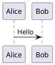

# PlantUML

PlantUML은 UML 다이어그램을 빠르게 생성하기 위한 오픈소스 도구입니다.

## 소개

PlantUML을 사용하면 시퀀스 다이어그램, 클래스 다이어그램, 유스케이스 다이어그램, 액티비티 다이어그램 등 다양한 UML 다이어그램을 간단한 텍스트 설명으로 생성할 수 있습니다.

## 주요 기능

- **다양한 다이어그램 유형**: 시퀀스 다이어그램, 클래스 다이어그램, 유스케이스 다이어그램, 상태 다이어그램, 액티비티 다이어그램 등
- **간단한 문법**: 일반 텍스트 설명으로 작성 및 유지보수가 용이
- **크로스 플랫폼**: Windows, macOS, Linux 지원
- **통합**: VS Code, IntelliJ, Eclipse 지원
- **실시간 미리보기**: 편집 시 즉시 효과 확인

## 빠른 시작

### 설치

```bash
# macOS
brew install plantuml

# Ubuntu
sudo apt install plantuml
```

### 사용



## 문서

- [설치 가이드](./1.安装文档.md)
- [사용 가이드](./2.使用指南.md)

## 관련 자료

- [공식 웹사이트](https://plantuml.com/)
- [온라인 편집기](https://www.plantuml.com/plantuml)

## 라이선스

GPL License
