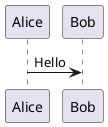
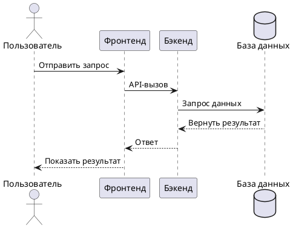
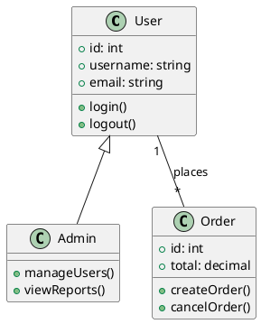
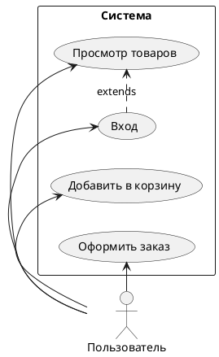
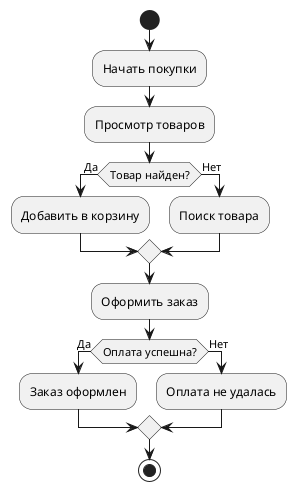
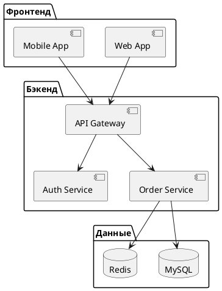
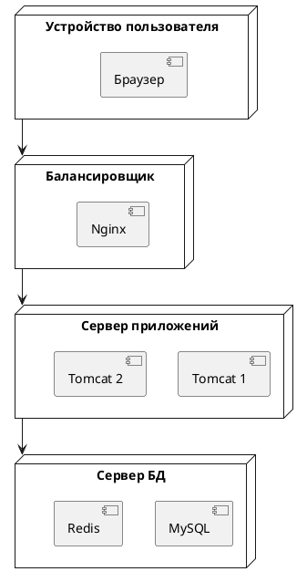
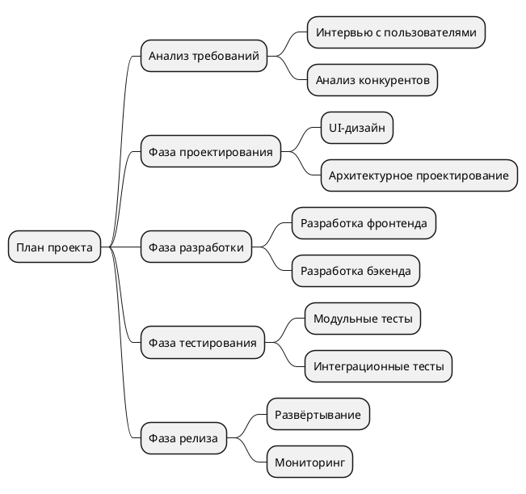
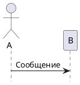
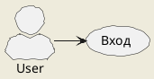

# Руководство по использованию PlantUML

В этом руководстве объясняется, как использовать PlantUML для создания различных UML-диаграмм.

## Быстрый старт

### Базовый синтаксис



## Диаграмма последовательности



## Диаграмма классов



## Диаграмма вариантов использования



## Диаграмма состояний

```plantuml
@startuml
[*] --> Ожидание оплаты
Ожидание оплаты --> Оплачено: Оплата успешна
Оплачено --> Отправлено: Отправка
Отправлено --> Доставлено: Доставка
Доставлено --> [*]
Ожидание оплаты --> Отменено: Пользователь отменил
Отменено --> [*]
@enduml
```

## Диаграмма активности



## Диаграмма компонентов



## Диаграмма развёртывания



## Временная диаграмма

```plantuml
@startuml
clock "Часы" as C with period 1000
binary "Синхронизация" as SY
binary "Данные" as DT

C is idle
SY is low
DT is low

@1000
SY is high
@1500
SY is low
@2000
DT is high
@3000
DT is low
@enduml
```

## Диаграмма Ганта

```plantuml
@startuml
[Проектирование] lasts 5 days
[Разработка] lasts 10 days
[Тестирование] lasts 5 days
[Релиз] lasts 3 days

[Проектирование] starts at 2024-01-01
[Разработка] starts at 2024-01-06
[Тестирование] starts at 2024-01-16
[Релиз] starts at 2024-01-21
@enduml
```

## Интеллект-карта



## Частые команды

### Скрытие элементов



### Настройка стилей



## Ресурсы

- [Официальный сайт PlantUML](https://plantuml.com/)
- [Справочник по синтаксису PlantUML](https://plantuml.com/sitemap-language-specification)
