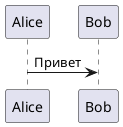
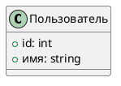

# PlantUML Руководство пользователя

## Базовый синтаксис

### Диаграмма последовательности

```plantuml
@startuml
Alice -> Bob: Привет
@enduml
```

### Диаграмма классов

```plantuml
@startuml
class Пользователь {
    +id: int
    +имя: string
}
@enduml
```
