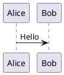

# PlantUML

PlantUML — это инструмент с открытым исходным кодом для быстрого создания UML-диаграмм.

## Введение

PlantUML позволяет создавать различные UML-диаграммы с помощью простых текстовых описаний, включая диаграммы последовательности, диаграммы классов, диаграммы вариантов использования, диаграммы активности и другие.

## Основные характеристики

- **Различные типы диаграмм**: Диаграммы последовательности, классов, вариантов использования, состояний, активности и т.д.
- **Простой синтаксис**: Текстовое описание, легко писать и поддерживать
- **Кроссплатформенность**: Поддержка Windows, macOS, Linux
- **Интеграция**: Поддержка VS Code, IntelliJ, Eclipse
- **Предварительный просмотр в реальном времени**: Эффект виден сразу при редактировании

## Быстрый старт

### Установка

```bash
# macOS
brew install plantuml

# Ubuntu
sudo apt install plantuml
```

### Использование



## Документация

- [Руководство по установке](./1.安装文档.md)
- [Руководство по использованию](./2.使用指南.md)

## Ресурсы

- [Официальный сайт](https://plantuml.com/)
- [Онлайн-редактор](https://www.plantuml.com/plantuml)

## Лицензия

GPL License
