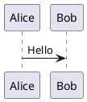
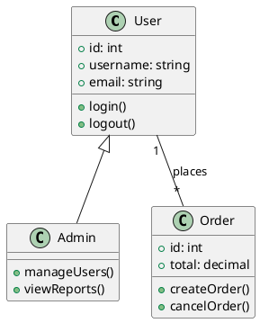
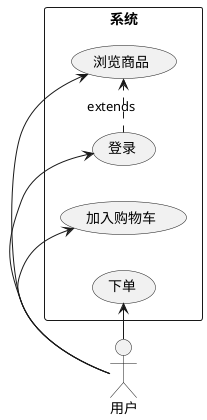
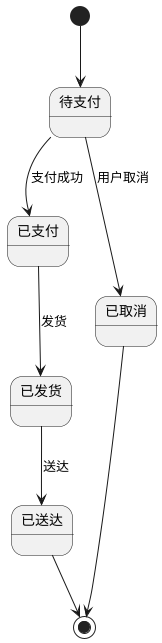
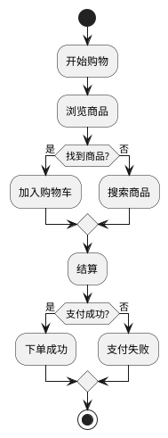
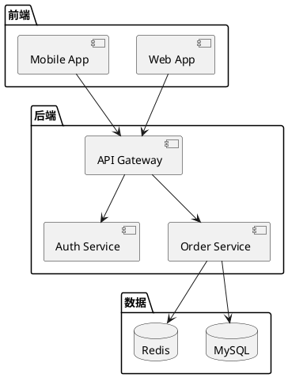
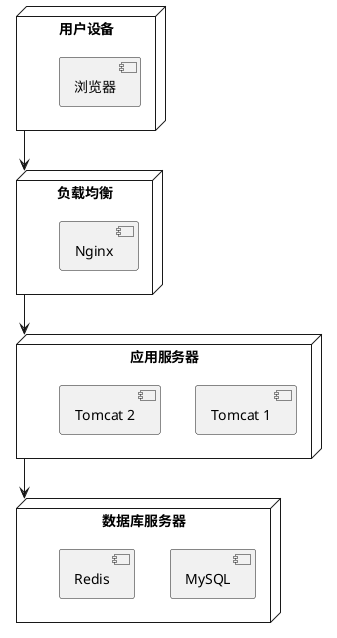
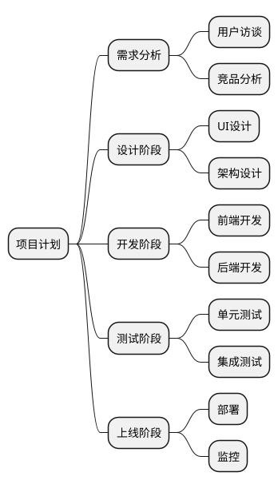
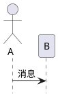

# PlantUML 使用指南

本指南介绍如何使用 PlantUML 创建各种 UML 图。

## 快速开始

### 基本语法


```

##plantuml
@startuml
actor 用户
participant "前端" as Front
participant "后端" as Back
database "数据库" as DB

用户 -> Front: 提交请求
Front -> Back: API 调用
Back -> DB: 查询数据
DB --> Back: 返回结果
Back --> Front: 响应
Front --> 用户: 显示结果
@enduml
```

## 类图



## 用例图



## 状态图



## 活动图



## 组件图



## 部署图



## 时序图

```plantuml
@startuml
clock "时钟" as C with period 1000
binary "同步" as SY
binary "数据" as DT

C is idle
SY is low
DT is low

@1000
SY is high
@1500
SY is low
@2000
DT is high
@3000
DT is low
@enduml
```

## 甘特图

```plantuml
@startuml
[设计] lasts 5 days
[开发] lasts 10 days
[测试] lasts 5 days
[上线] lasts 3 days

[设计] starts at 2024-01-01
[开发] starts at 2024-01-06
[测试] starts at 2024-01-16
[上线] starts at 2024-01-21
@enduml
```

## 思维导图



## 常用指令

### 隐藏元素



### 样式设置

```plantuml
@startuml
skinparam backgroundColor #EEEBDC
skinparam handwritten true
skinparam actorStyle awesome

actor User
User -> (登录)
@enduml
```



## 相关资源

- [PlantUML 官方网站](https://plantuml.com/)
- [PlantUML 语法参考](https://plantuml.com/sitemap-language-specification)
