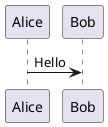

# PlantUML

PlantUML 是一个用于快速创建 UML 图的开源工具。

## 简介

PlantUML 允许您使用简单的文本描述来创建各种 UML 图，包括序列图、类图、用例图、活动图等。

## 主要特性

- **多种图表类型**：序列图、类图、用例图、状态图、活动图等
- **简单语法**：纯文本描述，易于编写和维护
- **跨平台**：支持 Windows、macOS、Linux
- **集成**：支持 VS Code、IntelliJ、Eclipse
- **实时预览**：编辑即可见效果

## 快速开始

### 安装

```bash
# macOS
brew install plantuml

# Ubuntu
sudo apt install plantuml
```

### 使用



## 文档

- [安装指南](./1.安装文档.md)
- [使用指南](./2.使用指南.md)

## 相关资源

- [官方网站](https://plantuml.com/)
- [在线编辑器](https://www.plantuml.com/plantuml)

## 许可证

GPL License
