# PlantUML 使用指南

本指南介紹如何使用 PlantUML 建立各種 UML 圖。

## 快速開始

### 基本語法

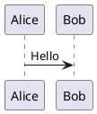

## 序列圖

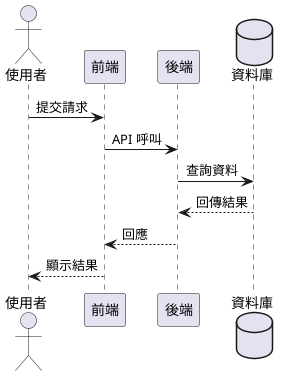

## 類別圖

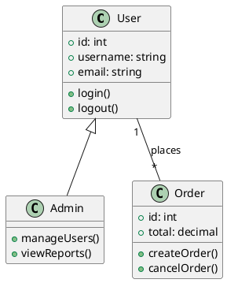

## 用例圖

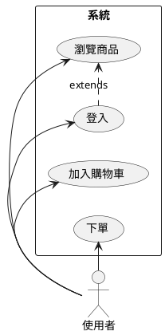

## 狀態圖

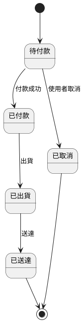

## 活動圖

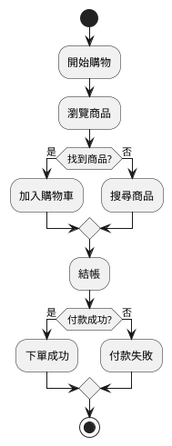

## 元件圖

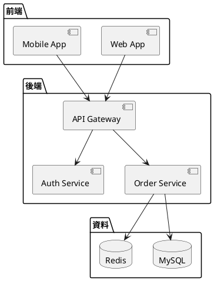

## 部署圖

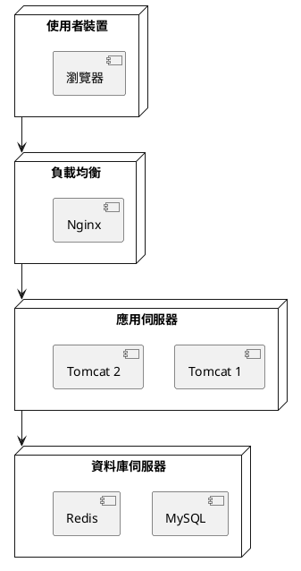

## 時序圖

```plantuml
@startuml
clock "時鐘" as C with period 1000
binary "同步" as SY
binary "資料" as DT

C is idle
SY is low
DT is low

@1000
SY is high
@1500
SY is low
@2000
DT is high
@3000
DT is low
@enduml
```

## 甘特圖

```plantuml
@startuml
[設計] lasts 5 days
[開發] lasts 10 days
[測試] lasts 5 days
[上線] lasts 3 days

[設計] starts at 2024-01-01
[開發] starts at 2024-01-06
[測試] starts at 2024-01-16
[上線] starts at 2024-01-21
@enduml
```

## 思維導圖

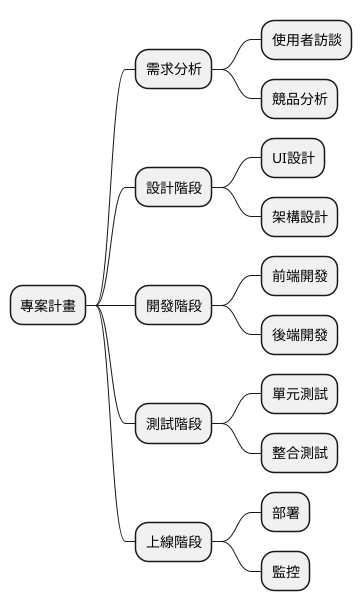

## 常用指令

### 隱藏元素

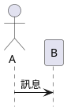

### 樣式設定

```plantuml
@startuml
skinparam backgroundColor #EEEBDC
skinparam handwritten true
skinparam actorStyle awesome

actor User
User -> (登入)
@enduml
```

## 相關資源

- [PlantUML 官方網站](https://plantuml.com/)
- [PlantUML 語法參考](https://plantuml.com/sitemap-language-specification)
