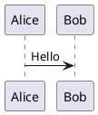

# PlantUML

PlantUML 是一個用於快速建立 UML 圖的開源工具。

## 簡介

PlantUML 允許您使用簡單的文字描述來建立各種 UML 圖，包括序列圖、類別圖、用例圖、活動圖等。

## 主要特性

- **多種圖表類型**：序列圖、類別圖、用例圖、狀態圖、活動圖等
- **簡單語法**：純文字描述，易於編寫和維護
- **跨平台**：支援 Windows、macOS、Linux
- **整合**：支援 VS Code、IntelliJ、Eclipse
- **即時預覽**：編輯即可見效果

## 快速開始

### 安裝

```bash
# macOS
brew install plantuml

# Ubuntu
sudo apt install plantuml
```

### 使用



## 文件

- [安裝指南](./1.安裝文檔.md)
- [使用指南](./2.使用指南.md)

## 相關資源

- [官方網站](https://plantuml.com/)
- [線上編輯器](https://www.plantuml.com/plantuml)

## 授權

GPL License
